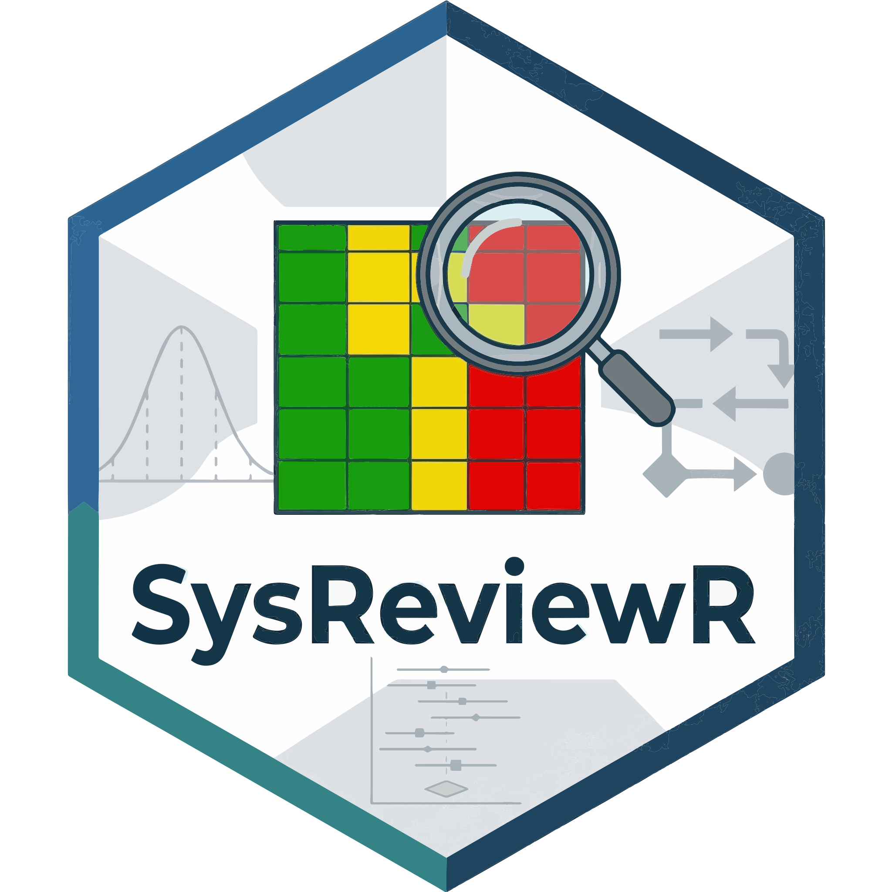

# 👨🏻‍🔬 ¡Hola! Soy Conrado Montes de Oca

**Científico de datos certificado y bioestadístico**, apasionado por transformar datos en conocimiento útil y accesible. Mi trabajo combina el rigor científico con la claridad didáctica, buscando que la estadística y el análisis de datos sean herramientas prácticas para todo aquello que necesite una respuesta dependiente de datos.

Además soy el creador de **SysReviewR** una librería en R para permitir a los investigadores trabajar más eficientemente en sus revisiones sistemáticas y meta-análisis. 

------------------------------------------------------------------------

## Proyectos: 

- [The International Stroke Trial:](https://montesdeoca-md.github.io/Portfolio-International-Stroke-Trial/) Reanálisis de uno de los ensayos clínicos aleatorizados sobre Stroke más grandes jamás realizados. 

------------------------------------------------------------------------

## Tecnologías y Lenguajes

------------------------------------------------------------------------

## 🎓 Certificaciones

  
  
  
  
  

  
  
  

  
  
  

------------------------------------------------------------------------

## 📂 Qué encontrarás en mi GitHub

-   El repositorio oficial de ``SysReviewR``
-   Material suplementario de mis **publicaciones académicas**
-   Ejemplos de proyectos de **análisis de datos** y **ciencia de datos**
-   Códigos de análisis reproducibles y adaptados para enseñanza y práctica clínica

------------------------------------------------------------------------

## 📚 ¿Deseas mejorar en R? 

He creado un repositorio llamado [Weekly Challanges in R](https://github.com/montesdeoca-md/Weekly_Challange_R)
en el cuál semana con semana iré publicando ejercicios para que mejores en R, estadística y Data Science.

Creo firmemente que la estadística no debe ser un obstáculo, sino un puente hacia mejores decisiones 
en el área de la salud y la biología. Por eso comparto mis recursos y ejercicios 
con la intención 
de **hacer más sencilla y clara la estadística para todos aqellos interesados**, 
contribuyendo a una práctica científica más informada y accesible.

------------------------------------------------------------------------
